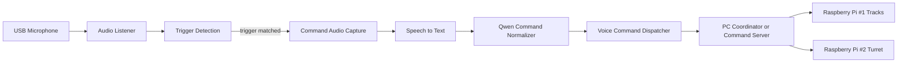

# Voice Command Pipeline Plan

## Current Context

- Workspace currently has a local Qwen inference setup and no voice pipeline implementation yet.
- Qwen is served from `llama.cpp` using the local GGUF model:
  - model: `/home/usr1/bootcamp_ws/Qwen3-4B-Instruct-2507-Q6_K/Qwen_Qwen3-4B-Instruct-2507-Q6_K.gguf`
  - server: `/home/usr1/bootcamp_ws/llama.cpp/build/bin/llama-server`
  - port: `8080`
- There is also an existing distributed control stack in `/home/usr1/bootcamp_ws/TankControllerRasberryPi`:
  - Raspberry Pi #1 runs `run_rpi1_tracks.py` for body/track control
  - Raspberry Pi #2 runs `run_rpi2_turret.py` for turret/fire control
  - a PC-side TCP server receives newline-delimited JSON from both Pi nodes
- Runtime context observed on this board:
  - Linux `aarch64`
  - NVIDIA Orin class CUDA device available
- This means the LLM stage is already locally runnable, and the missing pieces are audio ingestion, trigger detection, STT, command normalization, and integration with the existing TankController transport.

## Final Goal

Build a local voice-command pipeline under `bootcamp_ws` with the following end-to-end behavior:

1. Continuously listen to USB microphone input.
2. Detect a trigger phrase such as `마이크작동` and then enter command capture mode.
3. Convert the user's speech to text using STT.
4. Send the text to Qwen and transform it into a predefined machine command.
5. Transmit that command to another PC or system over the network.

## Recommended High-Level Architecture



## Existing TankController Transport

### Current Node Topology

The current control system is not a generic HTTP service. It is a multi-node TCP JSON stream.

- `run_rpi1_tracks.py` sends track/body control results with role `player1_tracks`
- `run_rpi2_turret.py` sends turret/fire control results with role `player2_turret`
- `server/pc_result_server.py` receives newline-delimited JSON and stores the latest payload by `role`

This matters because the Orin voice feature should align with the existing transport instead of inventing a separate control path unless there is a strong reason to isolate it.

### Existing Envelope Format

The current sender wrapper in `TankControllerRasberryPi/client/runtime_stream.py` sends payloads in this outer structure:

```json
{
  "role": "player1_tracks",
  "device_id": "rpi1",
  "frame_id": 123,
  "timestamp": "2026-06-25T12:34:56.000000+00:00",
  "fps": 20.0,
  "result": {
    "...": "node-specific fields"
  }
}
```

### Existing `player1_tracks` Result Shape

Observed fake/default schema from `run_rpi1_tracks.py`:

```json
{
  "has_pose": true,
  "left_value": 0.0,
  "right_value": 0.0,
  "left_label": "STOP",
  "right_label": "STOP",
  "drive_label": "IDLE"
}
```

This indicates the tracks node currently represents left/right drive values and human-readable drive labels.

### Existing `player2_turret` Result Shape

Observed fake/default schema from `run_rpi2_turret.py`:

```json
{
  "has_pose": true,
  "yaw_value": 0.0,
  "yaw_deg": 0.0,
  "yaw_label": "STOP",
  "pitch_value": 0.0,
  "pitch_ref_y": null,
  "pitch_label": "STOP",
  "fire": "idle",
  "left_hand_state": "missing",
  "right_hand_state": "missing"
}
```

This indicates the turret node currently represents yaw, pitch, and fire state.

## Orin Voice Integration Strategy

### Key Constraint

The existing PC server groups incoming messages by `role` and currently behaves as a monitor/logging aggregation point.

That means:

- adding a new voice sender with a new `role` is structurally easy
- but executing voice commands still requires a command consumer or coordinator beyond the current logging server

### Recommended Integration Direction

Do not overload `player1_tracks` or `player2_turret` with voice-generated payloads.

Instead, add a third logical channel from the Orin board:

- initial design idea:
  - `role`: `voice_command`
  - `device_id`: for example `orin_voice`
- current implementation choice:
  - `role`: `player3_voice`
  - `device_id`: `player3_orin`

Reason:

- preserves the semantics of the existing Pi streams
- makes voice-originated commands auditable
- lets the coordinator distinguish between pose-derived control and voice-derived commands
- avoids breaking downstream assumptions tied to track/turret result schemas

### Recommended Voice Command Envelope

To stay compatible with the current transport style, the Orin board should emit the same outer envelope:

```json
{
  "role": "voice_command",
  "device_id": "orin_voice",
  "frame_id": 1,
  "timestamp": "2026-06-25T12:34:56.000000+00:00",
  "fps": 0.0,
  "result": {
    "command_kind": "simple_motion",
    "target_role": "player1_tracks",
    "action": "move_forward",
    "params": {
      "distance_cm": 100,
      "speed": "normal"
    },
    "raw_text": "전진 1미터",
    "confidence": 0.94,
    "needs_confirmation": false
  }
}
```

## Current Implementation Snapshot

- One-shot entrypoint: `voice_agent/run_voice_to_qwen.py`
- Standby loop entrypoint: `voice_agent/run_voice_pipeline.py`
- Trigger phrase flow: short wake-window recording -> STT -> trigger match -> command recording -> Qwen parse -> optional TCP send -> return to standby
- Current fixed command schema:
  - `reload`
  - `scanning`
  - `reject`

## Voice Command Categories

The new voice feature should not be treated as a generic chat interface. It should normalize into a bounded command set.

### 1. Simple Control Commands

These are short direct commands that map to movement or aiming actions.

Examples:

- `전진 50센티`
- `후진 1미터`
- `왼쪽으로 30도 회전`
- `포탑 오른쪽 15도`
- `포신 아래로 조금`
- `정지`

Recommended normalized examples:

```json
{
  "command_kind": "simple_motion",
  "target_role": "player1_tracks",
  "action": "move_forward",
  "params": {
    "distance_cm": 50
  }
}
```

```json
{
  "command_kind": "simple_motion",
  "target_role": "player2_turret",
  "action": "yaw_right",
  "params": {
    "angle_deg": 15
  }
}
```

### 2. Special Commands

These are higher-level commands that do not map directly to the existing track/turret continuous control fields.

Examples:

- `조준 모드 시작`
- `사격 준비`
- `안전 모드`
- `긴급 정지`
- `음성 제어 해제`
- `복귀 위치로 이동`

Recommended normalized examples:

```json
{
  "command_kind": "special_command",
  "target_role": "system",
  "action": "enter_safe_mode",
  "params": {}
}
```

```json
{
  "command_kind": "special_command",
  "target_role": "player2_turret",
  "action": "arm_fire_control",
  "params": {}
}
```

### 3. Reject and Confirmation Cases

Examples that should not dispatch immediately:

- ambiguous distance or angle
- unsupported action
- dangerous fire-related command without safety state
- commands affecting both Pi nodes without explicit confirmation

Recommended normalized example:

```json
{
  "command_kind": "reject",
  "target_role": "system",
  "action": "reject",
  "params": {
    "reason": "ambiguous_command"
  },
  "needs_confirmation": true
}
```

## Design Direction

### 1. Trigger Detection Strategy

For the trigger phrase `마이크작동`, the most practical first version is not a dedicated wake-word engine but a rolling audio pipeline with:

- VAD to detect speech segments
- short-window STT on recent speech
- exact or fuzzy match against the trigger phrase

Reason:

- Korean custom wake-word support is weaker in many off-the-shelf wake-word engines.
- A rolling STT-based trigger path is simpler to prototype and easier to tune for Korean.
- This approach also keeps the stack fully local.

If later latency or false activations become a problem, a dedicated wake-word engine can be added as a second-stage optimization.

### 2. STT Engine Strategy

Use an offline STT engine first.

Preferred evaluation order:

1. `whisper.cpp`
2. `faster-whisper`

Reason:

- `whisper.cpp` is lightweight and fits the current local-inference style already used with `llama.cpp`.
- `faster-whisper` may provide better Python integration, but deployment on Jetson can be more dependency-sensitive.

Initial target is not perfect transcription quality. The target is stable conversion of a narrow command domain.

### 3. Qwen Command Conversion Strategy

Do not start with fine-tuning.

Start with:

- a strict system prompt
- a fixed command schema
- JSON-only output constraints
- validation before network dispatch

Reason:

- For command normalization, prompt+schema control is cheaper and faster than training.
- Reliability can be improved significantly if Qwen is asked to output only a bounded JSON structure.
- Fine-tuning or LoRA should only be considered if prompt-level control is not sufficient after evaluation.

### 4. Network Transfer Strategy

For generic prototyping, HTTP `POST` is still a valid quick path.

For this specific project, the preferred integration path is to align with the existing TankController transport first:

- newline-delimited JSON over TCP
- shared envelope fields: `role`, `device_id`, `frame_id`, `timestamp`, `fps`, `result`
- separate command consumer on the PC side that understands `voice_command`

Recommended first command contract inside `result`:

```json
{
  "command_kind": "simple_motion",
  "target_role": "player1_tracks",
  "action": "move_forward",
  "params": {
    "distance_cm": 10
  },
  "raw_text": "왼쪽으로 10센티 이동해",
  "confidence": 0.93,
  "request_id": "uuid-string",
  "needs_confirmation": false
}
```

If the downstream system later needs stronger decoupling, MQTT or ROS bridge can be evaluated after the first TCP-compatible version works.

## Proposed Execution Phases

### Phase 0. Baseline Validation

Goal:

- verify Qwen server stability
- verify USB microphone detection
- verify audio recording and playback path

Deliverables:

- one command to start Qwen server
- one command to record test audio
- one command to submit a test prompt to Qwen

### Phase 1. Audio Listener and Trigger Detection

Goal:

- keep microphone open continuously
- segment speech with VAD
- detect trigger phrase from rolling transcripts

Deliverables:

- background listener loop
- trigger phrase detector for `마이크작동`
- logs for trigger match, false positive, timeout

Success condition:

- system enters command capture mode only after trigger phrase is detected

### Phase 2. Command STT

Goal:

- after trigger detection, record the next user utterance as the command
- convert the command utterance to text

Deliverables:

- command audio capture window
- STT inference module
- text cleanup step for punctuation and whitespace normalization

Success condition:

- short spoken commands are transcribed consistently enough for command parsing

### Phase 3. Qwen Command Normalizer

Goal:

- convert user text into an application-specific command object

Deliverables:

- Qwen client calling local `llama-server`
- prompt template defining allowed intents
- JSON schema for accepted outputs
- rejection path for ambiguous or unsafe commands

Success condition:

- Qwen emits only allowed command structures or explicitly rejects the request

### Phase 4. Network Dispatcher

Goal:

- transmit normalized command into the TankController network path

Deliverables:

- TCP JSON-line sender or compatible adapter
- command consumer or coordinator on the PC side
- contract for `voice_command.result`
- retries, timeout, and response logging

Success condition:

- PC-side coordinator receives a valid `voice_command` payload and routes it safely to the intended subsystem

### Phase 5. Integration and Hardening

Goal:

- connect all stages into one service
- improve latency and reliability

Deliverables:

- long-running service entrypoint
- state machine for `idle -> trigger_wait -> command_capture -> qwen_parse -> dispatch`
- structured logs
- failure recovery rules

Success condition:

- pipeline survives common failures without manual restart

## Recommended State Machine

```text
IDLE_LISTENING
  -> trigger phrase detected
TRIGGERED
  -> start command recording
COMMAND_CAPTURE
  -> end of speech or timeout
STT_PROCESSING
  -> transcript ready
QWEN_PARSING
  -> valid command
DISPATCHING
  -> success or failure
IDLE_LISTENING
```

## Recommended Output Contract for Qwen

Qwen should not return free-form prose in the command path. It should return only bounded JSON.

Example:

```json
{
  "command_kind": "simple_motion",
  "target_role": "player1_tracks",
  "action": "move_forward",
  "params": {
    "distance_cm": 10
  },
  "confidence": 0.93,
  "needs_confirmation": false
}
```

If parsing fails or the request is ambiguous:

```json
{
  "command_kind": "reject",
  "target_role": "system",
  "action": "reject",
  "params": {
    "reason": "ambiguous_command"
  },
  "confidence": 0.41,
  "needs_confirmation": true
}
```

## TankController-Aware Command Mapping

The voice layer should be modeled as an additional command source for the existing distributed vehicle system.

Recommended ownership split:

- Raspberry Pi #1 keeps responsibility for track/body execution
- Raspberry Pi #2 keeps responsibility for turret/fire execution
- Orin adds high-level voice command understanding
- PC-side coordinator decides how a `voice_command` maps to one or both downstream nodes

### Recommended Target Mapping

- `player1_tracks`: forward, reverse, stop, turn, pivot, move distance
- `player2_turret`: yaw, pitch, hold aim, fire-arm state, fire request
- `system`: safe mode, emergency stop, voice enable/disable, mission mode, calibration mode

### Important Design Note

The current Pi payloads look like streaming state/result messages, not explicit imperative command packets.

So the most likely clean architecture is:

1. Orin produces normalized `voice_command` messages.
2. A PC-side coordinator interprets them.
3. The coordinator translates them into the actual control method required by each subsystem.

This is safer than forcing voice commands directly into the current `player1_tracks` and `player2_turret` result schemas.

## Recommended Project Structure

This is a proposed next structure under `bootcamp_ws`:

```text
bootcamp_ws/
  context1.md
  scripts.txt
  llama.cpp/
  Qwen3-4B-Instruct-2507-Q6_K/
  TankControllerRasberryPi/
  voice_agent/
    README.md
    requirements.txt
    src/
      main.py
      audio_listener.py
      trigger_detector.py
      stt_engine.py
      qwen_client.py
      command_schema.py
      dispatcher.py
      state_machine.py
      tankcontroller_sender.py
      tankcontroller_mapping.py
    config/
      intents.json
      prompt.md
```

## Immediate Implementation Plan

### Step 1. Lock the command schema

Before writing pipeline code, define:

- allowed intents
- mapping from intents to `player1_tracks`, `player2_turret`, or `system`
- parameters per intent
- reject conditions
- confirmation-required conditions

This is the most important interface because STT, Qwen, and remote dispatch all depend on it.

### Step 2. Bring up a minimal end-to-end stub

Build a first working path with shortcuts:

- manual text input instead of microphone
- manual text input to Qwen
- command JSON output
- TCP JSON-line send with `role=voice_command`
- optional local dummy coordinator on the PC side

This isolates the command schema and Qwen prompt before audio complexity is added.

### Step 3. Add STT after the text path works

Once text -> Qwen -> network is stable, add:

- recorded audio file input
- then live microphone input
- then continuous listening and trigger detection

This order reduces debugging complexity.

### Step 4. Only then optimize latency and wake-word behavior

Do not optimize too early.

First target:

- correct behavior
- recoverable failures
- inspectable logs

Second target:

- lower latency
- fewer false triggers
- better command accuracy

## Main Risks

### 1. Resource Contention on the Board

Running continuous STT and Qwen on the same Jetson may create latency spikes or GPU contention.

Mitigation:

- keep STT model small first
- serialize STT and Qwen if needed
- measure latency before choosing a larger model

### 2. Trigger Phrase Reliability

The phrase `마이크작동` may be inconsistently transcribed depending on microphone quality and background noise.

Mitigation:

- support alias phrases
- apply fuzzy matching threshold
- log false positives and misses

### 3. Ambiguous Natural Language

Users may issue commands outside the supported action set.

Mitigation:

- strict command schema
- explicit reject behavior
- optional confirmation for dangerous actions

### 4. Network Safety

Blindly dispatching commands is dangerous.

Mitigation:

- validate JSON before sending
- add request IDs and acknowledgements
- add confirmation gate for high-risk commands
- separate `special_command` from low-risk motion commands
- keep fire-related commands behind explicit arming logic

## Success Criteria

The first usable version is successful if it can:

1. listen continuously from a USB microphone
2. detect `마이크작동`
3. capture one spoken command
4. convert it to text locally
5. turn that text into a validated JSON command using local Qwen
6. send that command as a `voice_command` payload into the TankController transport
7. have a PC-side coordinator acknowledge and route the command safely

## Recommended Next Build Order

1. Define the command schema and allowed intents.
2. Build a text-only `Qwen -> JSON -> TCP voice_command` prototype.
3. Add offline STT for recorded audio files.
4. Add live USB microphone capture.
5. Add trigger detection and service loop.
6. Add a PC-side command coordinator for `voice_command`.
7. Add reliability, confirmation rules, and monitoring.

## Notes

- The current local Qwen setup is already enough for the command-normalization stage.
- The biggest architectural decision is not the LLM but the trigger/STT strategy.
- For this project, a narrow and validated command contract matters more than a general chatbot experience.
- The current TankController transport already gives a good envelope standard; the main missing piece is a coordinator that can execute `voice_command` safely.

## Conversation Save

This section summarizes the implementation progress from the current conversation.

### Repository state

- The working root was reorganized as `/home/usr1/TankControllerOrin`.
- A new git repository was initialized at this root.
- `TankControllerRasberryPi/` is treated as a separate external project and is ignored in the new repository.
- Large local model and dependency directories such as `llama.cpp/`, `whisper.cpp/`, and `Qwen3-4B-Instruct-2507-Q6_K/` are also ignored.

### STT pipeline implemented

- Added Orin-side voice pipeline entrypoint: `voice_agent/run_voice_to_qwen.py`
- Added local STT runtime wrapper: `voice_agent/src/stt_engine.py`
- Added local Qwen client: `voice_agent/src/qwen_client.py`
- Added STT and Qwen baseline documentation: `context2_stt.md`

Implemented behavior:

1. microphone recording
2. optional auto-stop after trailing silence
3. Korean STT using `whisper.cpp`
4. transcript submission to local Qwen on `llama-server`
5. raw and parsed JSON output display

### STT optimization summary

- Installed `whisper.cpp`
- Installed multilingual `small` and `medium` Whisper models
- Switched default STT profile to a fast Korean profile
- Added command-vocabulary prompt bias for STT
- Added timestamped runtime logs for recording, STT, Qwen, and total pipeline time
- Added auto-stop recording mode using speech start and trailing silence detection

### Qwen command parsing summary

- Added fixed prompt file: `voice_agent/config/command_prompt.md`
- Added fixed schema file: `voice_agent/config/command_schema.json`
- Added runtime schema validation in `voice_agent/src/qwen_client.py`

Current command parser behavior is intentionally narrow:

- `reload`
- `scanning`
- `reject`

### TankController transport integration summary

- Added sender helper: `voice_agent/src/tank_command_sender.py`
- Reused `TankControllerRasberryPi/client/runtime_stream.py` configuration style and JSON-over-TCP transport pattern
- Added optional `--send-command` flow in `voice_agent/run_voice_to_qwen.py`
- Implemented send skip when command is `reject`

### Current transmitted payload shape

Current voice-command payload is transmitted in a TankController-compatible envelope using a dedicated new player channel:

```json
{
  "role": "player3_voice",
  "device_id": "player3_orin",
  "frame_id": 1782373457400,
  "timestamp": "2026-06-25T07:44:17.400912+00:00",
  "fps": 0.0,
  "result": {
    "command": "reload"
  }
}
```

### Validation completed in this conversation

- verified local Qwen server startup and response
- verified microphone recording on the board
- verified STT transcript generation
- verified Qwen fixed JSON output for `reload`, `scanning`, and `reject`
- verified local TCP transmission to the TankController server using the `player3_voice` role

### Current next step

The current remaining architectural step is to add a coordinator or handler on the receiving side that consumes `player3_voice` payloads and turns them into actual runtime actions.